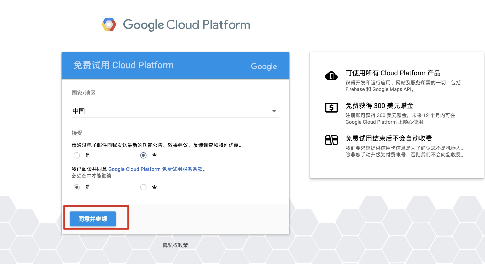
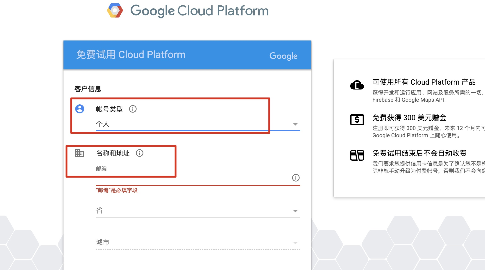
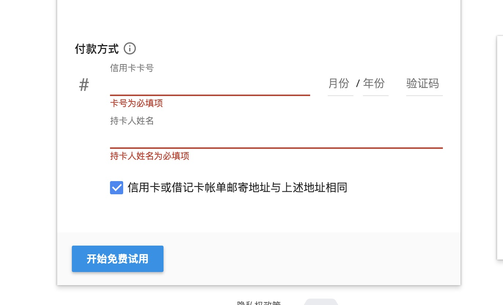
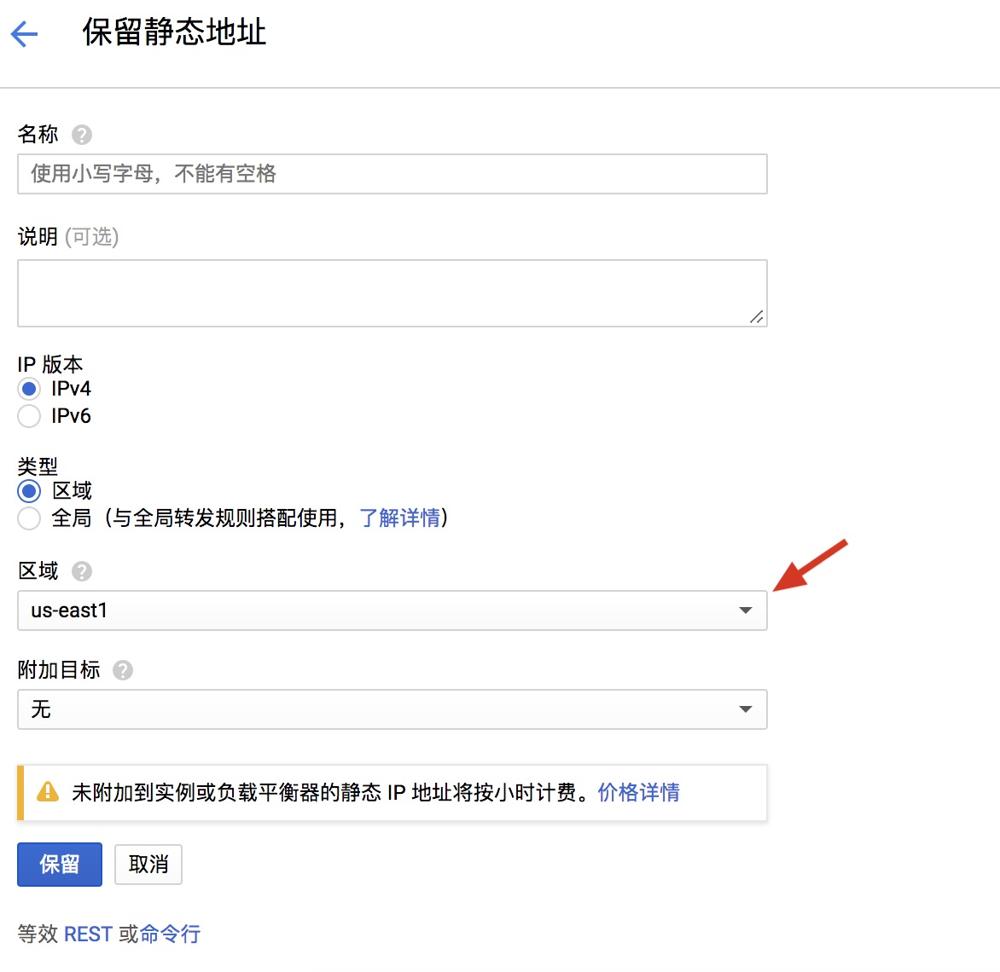
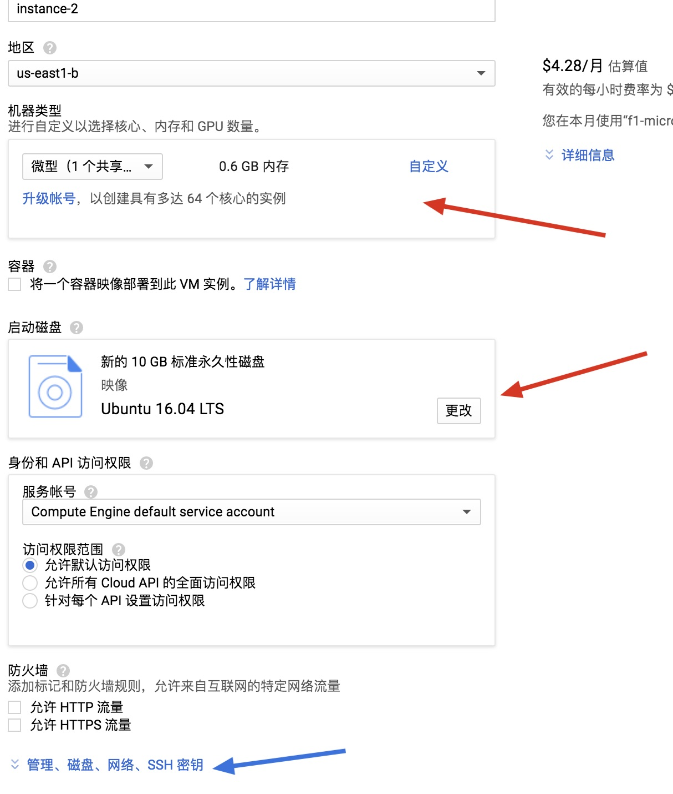
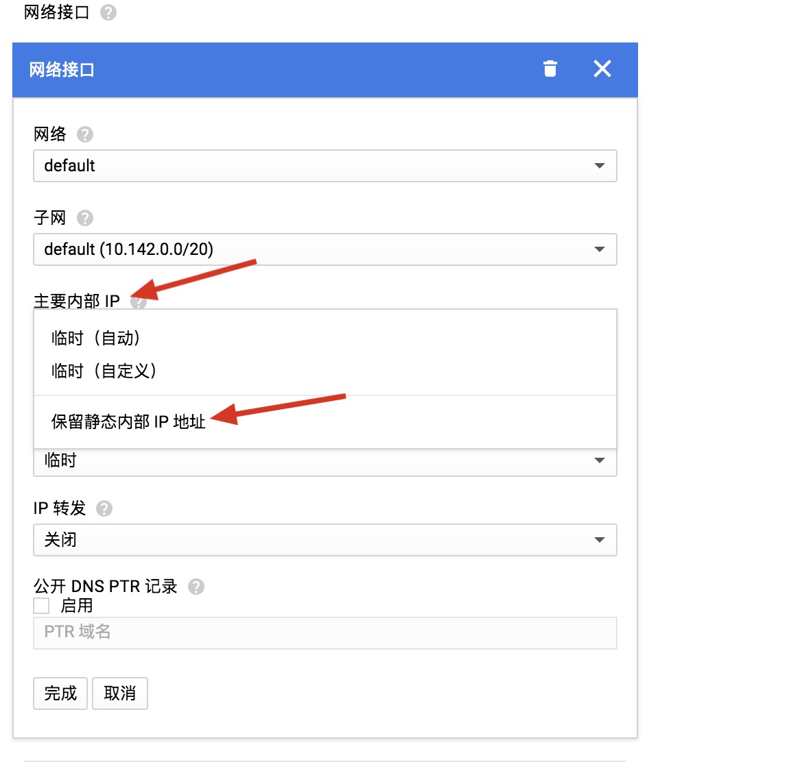
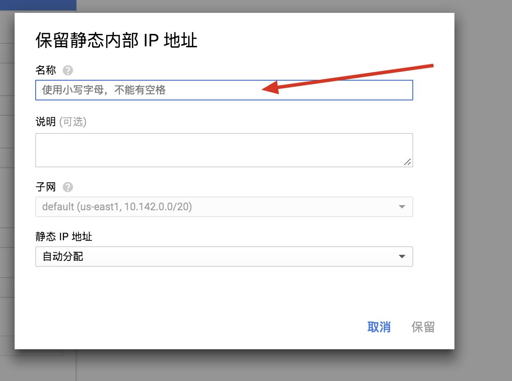
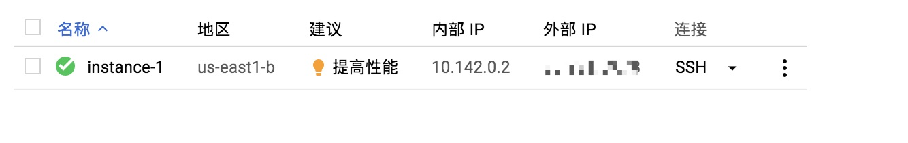
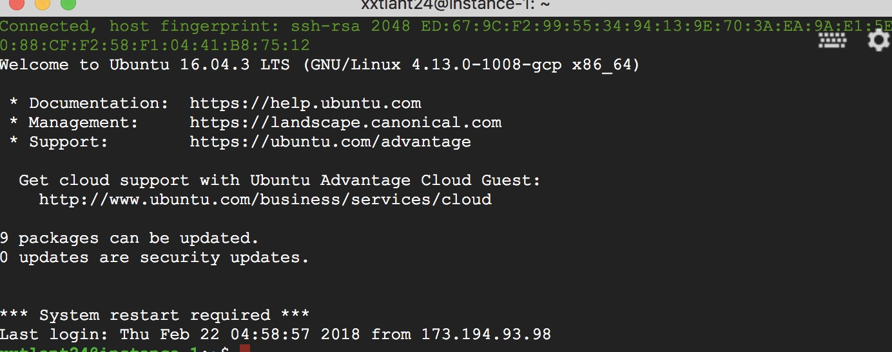
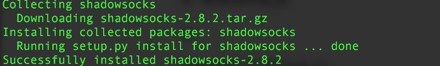

#### 以下内容，不需要编程基础
- 需要用到的工具
    - 可以访问 Google
    - 信用卡一张
    - Google 账户
- 如果没有科学上网工具，可以先下载使用 [蓝灯免费版](https://github.com/getlantern/forum/issues/833) 。

<!--more-->

#### 教程一共分为四步骤
1. 使用 Google Cloud 部署虚拟机
2. 升级VPS内核开启BBR
3. 搭建 Shadowsocks Server
4. 设置Shadowsocks server开机启动

### 一、 使用 Google Cloud 部署虚拟机
#### 1.申请使用Google Cloud
申请地址：[点击此处](https://cloud.google.com/free/)








登陆 Google 账户，**必须使用信用卡**，而且不能使用虚拟卡，招商银行、中信银行的全币种卡、浦发银行的 VISA 卡均可以通过验证。理论上 VISA 卡均可获得通过，选择中国后绑定信用卡，填写个人信息，可如实填写信用卡账单地址。成功后会于扣款1刀，验证卡片后会返还。
GCD 现在免费赠送 300 刀期限是一年，也就是 300 刀和一年时间谁先用完就以谁为准，**结束之后不点继续使用时不会扣费的**。

跳转后，如果你能看到页面顶部有一个“礼物 🎁 ” 的小图标，或者说你收到了相应的邮件，说明试用金已到账


上图是我的剩余试用时间以及剩余赠金

#### 2.修改防火墙
提前设置好后，后面设置完 ss 服务就可以直接使用了

访问链接：[点击此处](https://console.cloud.google.com/networking/firewalls/list)

或者在菜单中依次点击【VPC 网络】 –> 【防火墙规则】 –> 【创建防火墙规则】


更改红色箭头指向的几项。
名称自己随意起，IP 地址范围：**0.0.0.0/0**
点击创建会生成规则，请耐心等待。

#### 3.获取静态IP
获取静态 IP 很重要，只有有了静态IP，后面部署的SS服务才能用。

设置地址:[点击此处](https://console.cloud.google.com/networking/addresses/list?project=allow-all-ip-port-xxtlant)

或者在菜单中依次点击【VPC 网络】 –> 【外部 IP 地址】 –> 【保留静态地址】



**名称自定义即可**

PS：**静态 IP 只能申请一个！！！**

大陆速度最佳的机房是台湾彰化的机房了，asia-east1-c对大陆最友好
还有东京亚洲东区，也就是东京机房了asia-northeast1-a

#### 4.创建计算引擎
设置地址:[点击此处](https://console.cloud.google.com/compute/instances)

或者在菜单中依次点击【计算引擎】–> 【创建实例】



如图，机器类型选最便宜的**微型**就够用，启动磁盘选**Ubuntu16.04LTS**，我参照的教程是使用Ubuntu1604，所以我选择了这个。
点击蓝色箭头指向的 【管理、磁盘、网络、SSH 密钥】，去设置网络。





按图所示，点击 主要内部 IP 的保留静态 IP 地址，然后选择刚才创建的静态 IP 即可。点击创建即可完成。
等待一会后，出现下图所示，即已经完成创建。



至此，第一步已经完成。

### 二、升级VPS内核开启BBR(这一步，我不懂，是参考搜到的教程来设定的)

由于众所周知的原因，单纯部署完shadowsocks服务之后速度都不会太理想，即使你选择的是台湾、日本这种很好的线路，依然会存在丢包和不稳定的情况。

点击上图创建实例完成后，右边的 SSH。会弹出一个页面，如下图：



#### 准备工作
进入 ssh 后，先获取 root 权限

```
sudo –i
```
更新系统，两步分开执行，第二步耗时久一些

```
apt update
apt upgrade
```
查看当前内核

```
uname –a
```
#### 启用BBR
写入配置 两步分开执行

```
echo "net.core.default_qdisc=fq" >> /etc/sysctl.conf

echo "net.ipv4.tcp_congestion_control=bbr" >> /etc/sysctl.conf
```
配置生效

```
sysctl -p
```
检验

```
lsmod | grep bbr
```
看到显示`tcp_bbr 20480 xx ` 说明已经成功开启 BBR。**不需要重新启动**

至此，第二步已经结束，接下来直接开始在虚拟机部署 SS 服务。

### 三、搭建 Shadowsocks Server
首先更新一下 apt-get 软件包

```
sudo apt-get update
```
然后通过 apt-get 安装 python-pip

```
sudo apt-get install python-pip
```
完成之后使用 pip 安装 shadowsocks 服务

```
sudo pip install shadowsocks
```


说明安装成功了。

然后我们需要创建一个 shadowsocks server 的配置文件，可以直接建在当前用户目录下

```
sudo vim /etc/ss-conf.json
```
回车之后会进入这个创建的文件，
按键盘上的 i 键会进入编辑，然后把下面的内容输入进去。
按ESC键会发现左下角的insert消失，
使用组合键 **shift 加 ：** ，这个组合键左下角出现**：**，然后输入 **wq** 回车就保存退出文件。

```
{
"server":"0.0.0.0",
"server_port":000,
"local_address":"127.0.0.1",
"local_port":1080,
"password":"123456",
"timeout":600,
"method":"aes-256-cfb"
}
```
将上面的内容复制到创建的文件里就可以了。

<font size =4>**注意**
1. 代码的全部内容必须为**英文半角输入**，
2. **server_port**与**password**后面的数字内容**请自己设定**，这两个是你之后在shadowsocks客户端上配置使用的**端口和密码**。</font>

最后用这个配置文件启动 shadowsocks 服务

```
sudo ssserver -c /etc/ss-conf.json -d start
```

### 四、开启 Shadowsocks Server 开机启动
服务器可能会自动重启，这样的话就需要每次手动开启SS服务，很麻烦而且还会遇到要用梯子但是梯子在墙外的这种困境，怎么办呢？那么我们进入第四步，写脚本让系统开机后自动启动ss服务。

创建脚本 /etc/init.d/shadowsocks
```
sudo vim /etc/init.d/shadowsocks
```

进入文件后添加以下内容,方法与前面创建ss-conf.json这个文件一样，使用键盘字母 **i** 键、**shif 加 ：**、**wq**回车保存等等

```
#!/bin/sh
### BEGIN INIT INFO
# Provides: shadowsocks
# Required-Start: $remote_fs $syslog
# Required-Stop: $remote_fs $syslog
# Default-Start: 2 3 4 5
# Default-Stop: 0 1 6
# Short-Description: start shadowsocks
# Description: start shadowsocks
### END INIT INFO
start(){
　　　ssserver -c /etc/ss-conf.json -d start
}
stop(){
　　　ssserver -c /etc/ss-conf.json -d stop
}
case “$1” in
start)
　　　start
　　　;;
stop)
　　　stop
　　　;;
reload)
　　　stop
　　　start
　　　;;
*)
　　　echo “Usage: $0 {start|reload|stop}”
　　　exit 1
　　　;;
esac
```
然后增加这个文件的可执行权限

```
sudo chmod +x /etc/init.d/shadowsocks
```
创建文件 /etc/init/shadowsocks.conf

```
sudo vim /etc/init/shadowsocks.conf
```
内容直接复制如下

```
start on (runlevel [2345])stop on (runlevel [016])pre-start script
/etc/init.d/shadowsocks start
end script

post-stop script
/etc/init.d/shadowsocks stop
end script
```
执行

```
sudo update-rc.d shadowsocks defaults
```
然后就添加到开机启动中了
最后你可以 **Reboot** 测试一下看是否成功，若未成功就check一下第四步哪里有问题。

至此搭建已经全部完成了。


### SSR 客户端 [下载地址](http://shadowsocks.org/en/download/clients.html)

直接下载文件

[Mac 版](/img/ShadowsocksX-NG.1.7.1.zip)

[Android](/img/com.github.shadowsocks.apk)
<!--more-->